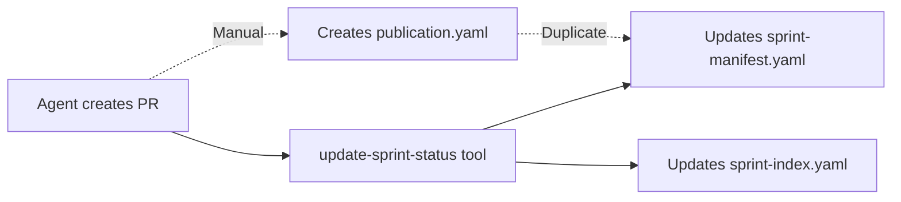

# Publication.yaml Requirement Analysis Report

**Sprint**: sprint-20-7zvpqa
**Date**: 2026-08-11
**Analyst**: Claude (Sprint Protocol Analyzer)

## Executive Summary

The `publication.yaml` requirement has become **problematic and redundant** in the current sprint process. This analysis recommends **deprecating publication.yaml** and consolidating its information into `sprint-manifest.yaml`, which is already the canonical source of truth for sprint metadata.

**Key Findings:**
- 80% redundancy between publication.yaml and sprint-manifest.yaml
- No standardized schema for publication.yaml across sprints
- Creates maintenance burden (3 files to update vs 1)
- Violates DRY principle and single source of truth

**Recommendation**: **Option 3** - Complete deprecation with migration path (see §6 Recommendations)

---

## 1. Current State Analysis

### 1.1 Protocol Requirements

According to Sprint Protocol (as of 2026-08-11):

**Location**: AGENTS-uncompressed.md §2.9, complete-sprint.ts:70-81

**Required Artifacts**:
```
planning/sprint-<id>/
  ├── verification-report.md
  ├── retro.md
  ├── key-learnings.md
  └── publication.yaml         ← REQUIRED
```

**Protocol Rule S13**:
> "Sprint cannot close until either (a) PR successfully created with URL in `publication.yaml`, or (b) failed PR attempt logged with error and user explicitly accepts closure"

**complete-sprint.ts validation**:
```typescript
const requiredArtifacts = [
  'verification-report.md',
  'retro.md',
  'key-learnings.md',
  'publication.yaml',    // ← Hard requirement
];
```

### 1.2 Actual Usage Patterns

Analysis of 16 completed sprints reveals **no standardized format**:

#### Format A: Comprehensive Metadata (Sprint 10)
```yaml
# 68 lines
sprint_id: sprint-10-t5kiid
title: "Sprint 10 Deliverables – Integration Testing..."
branch: feature/sprint-10-t5kiid-...
pr: https://github.com/cnavta/sprint-mcp/pull/10
deliverables: [...]
metrics:
  tests_created: 29
  coverage_before: 47.58%
  coverage_after: 66.02%
protocol_version: "2.4"
artifacts: {...}
validation: {...}
notes: |
  Overall coverage target...
```

#### Format B: Timeline-Focused (Sprint 19)
```yaml
# 21 lines
sprintId: sprint-19-hmbhz0
branch: feature/sprint-19-hmbhz0-...
branchPushed: true
prCreated: true
prUrl: https://github.com/cnavta/sprint-mcp/pull/19
preparationCompletedAt: 2026-08-11T22:44:00.000Z
branchPushedAt: 2026-08-11T22:47:00.000Z
prCreatedAt: 2026-08-11T22:48:00.000Z
notes: |
  Sprint completion artifacts created...
```

#### Format C: Structured Sections (Sprint 16)
```yaml
# 21 lines
pullRequest:
  url: https://github.com/cnavta/sprint-mcp/pull/17
  branch: feature/sprint-16-rgo90d-...
  baseBranch: main
  title: Sprint 16 Deliverables – ...
  createdAt: '2026-08-08T02:35:00Z'
  status: open
commit:
  sha: 789f0d3
  message: |
    Sprint 16: Sprint Lifecycle Hooks...
publication:
  date: '2026-08-08T02:35:00Z'
  method: github-cli
  successful: true
```

#### Format D: Minimal (Sprint 15)
```yaml
# 6 lines
pr: https://github.com/cnavta/sprint-mcp/pull/16
branch: feature/sprint-15-dq6cg7-...
status: created
createdAt: 2026-08-07T15:20:00.000Z
notes: PR created successfully via GitHub CLI
```

**Observation**: 4 different formats across 4 sprints = **no consensus on schema or purpose**

---

## 2. Redundancy Analysis

### 2.1 Information Overlap

| Information | publication.yaml | sprint-manifest.yaml | sprint-index.yaml |
|-------------|------------------|---------------------|-------------------|
| Sprint ID | ✅ (some) | ✅ `id` | ✅ `id` |
| Title | ✅ (some) | ✅ `title` | ✅ `title` |
| Branch | ✅ All formats | ✅ `links.branch` | ✅ `branch` |
| PR URL | ✅ All formats | ✅ `links.pr` | ✅ `pr` |
| Status | ✅ (some) | ✅ `status` | ✅ `status` |
| Created At | ✅ (some) | ✅ `createdAt` | ✅ `createdAt` |
| Completed At | ✅ (some) | ✅ `completedAt` | ✅ `completedAt` |
| Owner | ✅ (some) | ✅ `owner` | ✅ `owner` |
| Goal | ❌ | ✅ `goal` | ❌ |
| Notes | ✅ (most) | ✅ `notes` | ❌ |

**Redundancy Score**: ~80% overlap with sprint-manifest.yaml

### 2.2 Current Schema Support

**sprint-manifest.yaml** (src/types/sprint.ts:13-25):
```typescript
export interface SprintManifest {
  id: string;
  title: string;
  goal: string;
  owner: string;
  createdAt: string;
  status: SprintStatus;
  links?: {
    pr?: string;          // ← Already supports PR URL!
    branch: string;
  };
  notes?: string;         // ← Already supports notes!
}
```

**sprint-index.yaml** (src/types/sprint-index.ts:24-60):
```typescript
export interface SprintIndexEntry {
  id: string;
  title: string;
  status: SprintStatus;
  owner: string;
  createdAt: string;
  completedAt?: string;
  completionMode?: SprintCompletionMode;
  manifestPath: string;
  branch: string;
  pr?: string;            // ← Already supports PR URL!
  worktreePath?: string;
}
```

**publication.yaml**:
```typescript
// NO FORMAL SCHEMA!
// PublicationInfo interface exists (sprint.ts:48-53) but is never enforced
export interface PublicationInfo {
  pr_url?: string;
  branch: string;
  status: 'created' | 'failed' | 'pending';
  error?: string;
}
```

---

## 3. Problems Identified

### 3.1 Maintenance Burden

**Current workflow** when creating a PR:
1. Create PR via gh/API
2. Update `publication.yaml` with PR URL ← **Manual step**
3. Update `sprint-manifest.yaml` with PR URL via `update-sprint-status` tool
4. Update `sprint-index.yaml` via `update-sprint-status` tool
5. Commit all changes

**Failure points**:
- Agents may forget to create publication.yaml
- Inconsistent format across sprints
- 3 files to keep in sync
- Validation checks must scan 3 files

### 3.2 Schema Drift

No TypeScript interface enforcement means:
- Agents invent their own schemas
- No validation during creation
- Breaking changes invisible
- Parsing becomes brittle

Example: How to extract PR URL from publication.yaml?
```typescript
// All of these exist in real files:
yaml.pr                    // Sprint 15
yaml.prUrl                 // Sprint 19
yaml.pullRequest.url       // Sprint 16
yaml.pr_url                // PublicationInfo interface (unused)
```

### 3.3 Single Source of Truth Violation

**Current state**: 3 sources of truth
- What if publication.yaml says PR created but sprint-manifest.yaml says no PR?
- What if branch names differ across files?
- What if timestamps conflict?

**Expected state**: 1 source of truth (sprint-manifest.yaml) + 1 derived cache (sprint-index.yaml)

### 3.4 Tool Complexity

`complete-sprint.ts` must:
1. Validate publication.yaml exists (line 81)
2. Parse it (no schema to validate against)
3. Extract PR URL (which field? depends on format)
4. Cross-reference with sprint-manifest.yaml
5. Handle conflicts

**Simpler approach**: Read from sprint-manifest.yaml only

---

## 4. Evolution of the Process

### 4.1 Historical Context

**Early sprints (1-5)**:
- Manual PR creation
- publication.yaml as simple record: "PR created at URL X"
- No automated tools
- sprint-manifest.yaml was minimal

**Mid sprints (6-12)**:
- Introduction of MCP tools
- sprint-manifest.yaml expanded to include more metadata
- publication.yaml became more elaborate (see Sprint 10 format)
- Still mostly manual synchronization

**Recent sprints (13-19)**:
- Full automation via MCP tools
- `update-sprint-status` tool auto-updates manifest + index
- PR URLs tracked in manifest.links.pr
- publication.yaml format diverged (see 4 different schemas)
- Tool-driven process makes manual file creation problematic

### 4.2 Key Changes

| Change | Impact on publication.yaml |
|--------|---------------------------|
| MCP tools auto-update manifest | Manifest is now authoritative |
| sprint-index.yaml tracks PR URLs | Index is derived cache |
| Unified worktree model (Sprint 15) | Planning artifacts on feature branch |
| Schema evolution in sprint-manifest | More fields available in manifest |
| Archive system (Sprint 13) | More files to migrate/maintain |

### 4.3 Current Process (2026-08-11)



**Problem**: publication.yaml is a manual, duplicate step in an otherwise automated workflow

---

## 5. Value Assessment

### 5.1 Potential Value

**What publication.yaml could provide that manifest doesn't**:

1. **Publication Timeline**
   - preparationCompletedAt
   - branchPushedAt
   - prCreatedAt

   **Counter**: Can be added to sprint-manifest.yaml as optional fields

2. **Publication Method Tracking**
   - method: "github-cli" | "github-api" | "manual"
   - tool_version: "gh/2.x.x"

   **Counter**: Low value; rarely referenced

3. **Detailed PR Metadata**
   - title, body, assignees, reviewers
   - commit SHAs

   **Counter**: Available via GitHub API; no need to duplicate

4. **Human-Readable Summary**
   - Sprint 10 format with deliverables, metrics, notes

   **Counter**: This belongs in verification-report.md or retro.md

5. **Publication Audit Trail**
   - Who created PR
   - When each step happened
   - Errors encountered

   **Counter**: Already in request-log.md

### 5.2 Actual Value

Reviewing 16 sprints:

| Value Category | Times Used | Notes |
|----------------|-----------|-------|
| PR URL tracking | 16/16 | **But also in manifest + index** |
| Timeline tracking | 3/16 | Sprint 19, 16, 15 only |
| Publication method | 1/16 | Sprint 16 only |
| Comprehensive summary | 1/16 | Sprint 10 only (outlier) |
| Error logging | 0/16 | Never used |

**Conclusion**: The only consistently used field (PR URL) is already tracked in manifest and index.

---

## 6. Recommendations

### Option 1: Standardize publication.yaml ❌

**Approach**: Create formal schema, enforce via TypeScript

**Pros**:
- Maintains protocol requirement
- Enables rich publication metadata
- Backward compatible

**Cons**:
- Still violates DRY principle
- Still creates maintenance burden
- Doesn't solve redundancy problem
- Requires updating 16 existing sprints

**Verdict**: Solves schema drift but not redundancy

---

### Option 2: Make publication.yaml Optional ⚠️

**Approach**: Change protocol to make publication.yaml optional, prefer manifest

**Pros**:
- Gradual transition
- Agents can skip creation
- Maintains backward compatibility

**Cons**:
- Creates two classes of sprints (with/without)
- Validation logic must handle both cases
- Doesn't fully solve the problem
- Prolongs technical debt

**Verdict**: Half-measure that postpones decision

---

### Option 3: Deprecate publication.yaml ✅ RECOMMENDED

**Approach**: Remove publication.yaml requirement, migrate data to sprint-manifest.yaml

#### 3.1 Migration Plan

**Phase 1: Schema Enhancement**
Extend sprint-manifest.yaml to support publication metadata:

```typescript
export interface SprintManifest {
  id: string;
  title: string;
  goal: string;
  owner: string;
  createdAt: string;
  status: SprintStatus;
  completedAt?: string;
  completionMode?: SprintCompletionMode;

  links?: {
    pr?: string;
    branch: string;
  };

  // NEW: Optional publication metadata
  publication?: {
    method?: 'github-cli' | 'github-api' | 'manual';
    prCreatedAt?: string;
    branchPushedAt?: string;
    notes?: string;
  };

  notes?: string;
}
```

**Phase 2: Tool Updates**
- Update `complete-sprint.ts` to remove publication.yaml from required artifacts
- Update `update-sprint-status.ts` to write to manifest.publication if needed
- Update protocol docs (AGENTS-uncompressed.md, CLAUDE.md)
- Update rule S13 to reference manifest.links.pr instead of publication.yaml

**Phase 3: Backward Compatibility**
- Existing publication.yaml files remain (not deleted)
- New sprints don't create publication.yaml
- Migration script (optional) to extract data from old publication.yaml into manifests

**Phase 4: Documentation**
- Update examples in planning/
- Update README.md and README-development.md
- Add deprecation notice in protocol

#### 3.2 Benefits

1. **Single Source of Truth**: sprint-manifest.yaml is authoritative
2. **Reduced Maintenance**: 1 file to update instead of 3
3. **Tool Simplification**: No cross-file validation needed
4. **Schema Enforcement**: TypeScript types ensure consistency
5. **Backward Compatible**: Old publication.yaml files remain readable
6. **Future Proof**: Easier to extend manifest than manage separate file

#### 3.3 Risks & Mitigations

| Risk | Mitigation |
|------|-----------|
| Breaking existing tooling | Gradual rollout; keep old files |
| Loss of historical data | Don't delete existing publication.yaml |
| Resistance to change | Clear migration guide; demonstrate benefits |
| Agents confused by change | Update protocol; use deprecation warnings |

---

## 7. Implementation Scope

### If Recommendation Adopted (Option 3)

**Affected Files**:
- `src/types/sprint.ts` - Extend SprintManifest interface
- `src/tools/complete-sprint.ts` - Remove publication.yaml requirement
- `src/tools/update-sprint-status.ts` - Add publication metadata support
- `AGENTS-uncompressed.md` - Update protocol rules
- `AGENTS.md` - Regenerate compressed version
- `CLAUDE.md` - Update sprint directory structure
- `README.md` - Update documentation
- `README-development.md` - Update developer guide

**Estimated Effort**:
- Schema changes: 30 minutes
- Tool updates: 1-2 hours
- Protocol updates: 1 hour
- Testing: 1-2 hours
- Documentation: 1 hour

**Total**: ~5-6 hours

---

## 8. Conclusion

The `publication.yaml` requirement has outlived its usefulness. What began as a simple record of PR creation has become a source of:
- **Redundancy** (80% overlap with manifest)
- **Inconsistency** (4 different schemas across sprints)
- **Complexity** (3 files to maintain)
- **Technical Debt** (no formal schema, no validation)

The process has evolved to make `sprint-manifest.yaml` the canonical source of truth, with automated MCP tools updating it directly. publication.yaml is now a manual, redundant step in an otherwise automated workflow.

**Recommended Action**: **Deprecate publication.yaml** and consolidate its information into `sprint-manifest.yaml` per Option 3 (§6).

This will:
- Reduce maintenance burden
- Eliminate redundancy
- Improve consistency
- Simplify tooling
- Align with current automation-first approach

The migration can be done gradually with full backward compatibility, allowing existing sprints to retain their publication.yaml files while new sprints adopt the streamlined approach.

---

## Appendices

### A. Protocol References

- AGENTS-uncompressed.md §2.9: Sprint Completion
- AGENTS.md line 227: Directory structure showing publication.yaml
- AGENTS.md line 589-592: publication.yaml schema example
- AGENTS.md line 628: Rule requiring publication.yaml
- AGENTS.md line 743: Force completion rule mentioning publication.yaml
- src/tools/complete-sprint.ts:70-81: Required artifacts check
- src/types/sprint.ts:48-53: PublicationInfo interface (unused)
- src/types/sprint.ts:13-25: SprintManifest interface
- src/types/sprint-index.ts:24-60: SprintIndexEntry interface

### B. Sprint Samples Analyzed

| Sprint | Lines | Format | PR URL Field |
|--------|-------|--------|-------------|
| sprint-1 | ? | ? | ? |
| sprint-2 | ? | ? | ? |
| sprint-10 | 68 | Comprehensive | `pr` |
| sprint-15 | 6 | Minimal | `pr` |
| sprint-16 | 21 | Structured | `pullRequest.url` |
| sprint-19 | 21 | Timeline | `prUrl` |

### C. Alternative Approaches Considered

1. **Merge into request-log.md**: Too verbose; mixes concerns
2. **Separate publication-metadata.json**: Still redundant; different format
3. **Store in git commit message**: Not queryable; hard to parse
4. **Track in GitHub PR description**: Requires API calls; not offline-friendly
5. **Use git tags**: Doesn't track PR URL; not flexible enough

All rejected in favor of Option 3 (consolidate into sprint-manifest.yaml).

---

**End of Report**
